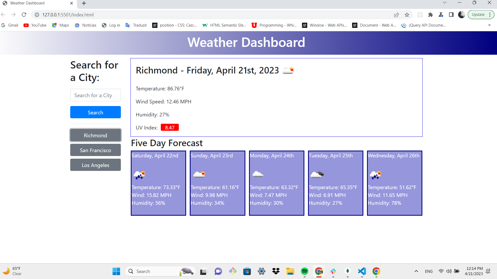

# weather-dashboard-challenge

## Server-Side APIs Challenge: Weather Dashboard 🌅☁️🌡️

## Description

This is a weather dashboard application with search functionality to find current weather conditions and the future weather outlook for multiple cities. This app will run in the browser and feature dynamically updated HTML and CSS powered by jQuery. It uses the [OpenWeather API](https://openweathermap.org/api) to retrieve weather data for cities. It uses AJAX to hook into the API to retrieve data in JSON format.

## User Story

```
AS A traveler
I WANT to see the weather outlook for multiple cities
SO THAT I can plan a trip accordingly
```

## Acceptance Criteria

```
GIVEN a weather dashboard with form inputs
WHEN I search for a city
THEN I am presented with current and future conditions for that city and that city is added to the search history
WHEN I view current weather conditions for that city
THEN I am presented with the city name, the date, an icon representation of weather conditions, the temperature, the humidity, the wind speed, and the UV index
WHEN I view the UV index
THEN I am presented with a color that indicates whether the conditions are favorable, moderate, or severe
WHEN I view future weather conditions for that city
THEN I am presented with a 5-day forecast that displays the date, an icon representation of weather conditions, the temperature, and the humidity
WHEN I click on a city in the search history
THEN I am again presented with current and future conditions for that city
```

## Mock-Up

The following image shows the web application's appearance and functionality:



## Links

* [GitHub Repository](https://github.com/Vinni99/weather-dashboard-challenge.git)

* [Deployed Application](https://vinni99.github.io/weather-dashboard-challenge/)